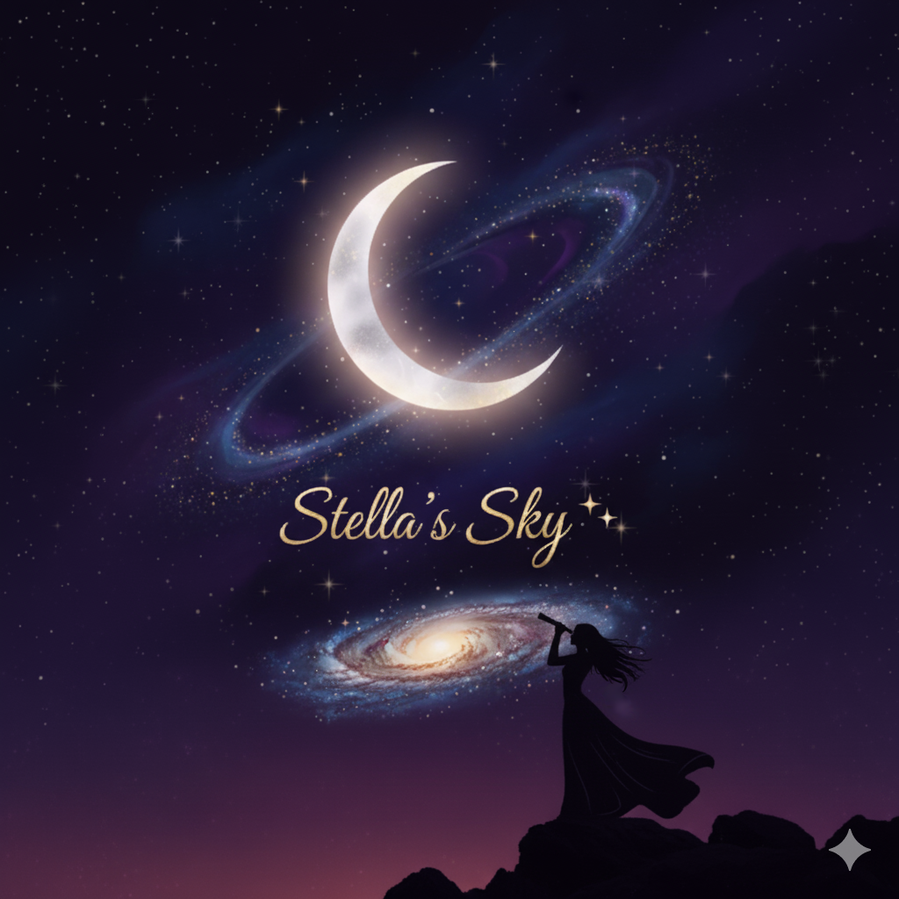

# Stella's Sky



Stella's Sky is a dreamy, celestial-themed task management mobile app that gamifies daily productivity through star and constellation metaphors. It becomes your personal galaxy that responds to task completion with beautiful animations, soft sounds, and personalized encouragement.

## 🌟 Features

### Core Functionality

- **Task Stars** 🌟
  - Each daily task is represented as a small star orbiting a central star
  - Star size varies based on priority (low, medium, high)
  - Tap to complete tasks with satisfying animations and sound effects
  - Automatic daily reset at midnight

- **Constellation Progress Tracker** 🌌
  - Completed tasks connect with glowing lines to form constellations
  - Weekly constellation patterns that symbolize your growth
  - Streak tracking with visual progress indicators
  - Beautiful weekly growth animations

- **Secret Stars (Hidden Messages)** 🎁
  - Unlock special hidden stars after maintaining streaks (7+ days)
  - Personal messages and quotes for milestone rewards
  - Automatic unlocking based on achievement milestones
  - Gallery view of all unlocked messages

- **Personalized Voice Notifications** 🎙️
  - Record custom voice reminders for tasks
  - Personalized notification messages ("Little Star, it's time to shine!")
  - Toggle between motivational and playful notification tones
  - Schedule notifications based on task timing

- **Customization Options** 🌙
  - **Three Sky Themes:**
    - Night Sky (default) - Deep midnight blue
    - Dawn Sky - Sunrise tones
    - Royal Purple Sky - Majestic violet
  - **Central Star Colors:** Gold, Silver, Pink
  - **Priority-Based Star Sizes:** Bigger stars for higher priority tasks

### Visual Design

- **Celestial Atmosphere:**
  - Deep midnight blue gradient background with subtle nebula haze
  - Animated stargazing effect with twinkling stars
  - Prominently glowing central star

- **Smooth Animations:**
  - Performance-optimized animations
  - Gentle star twinkling with opacity flicker
  - Pulse animations on task completion
  - Smooth constellation line drawing
  - Star spark notifications

- **Sound & Haptics:**
  - Soft chime sound on task completion
  - Haptic feedback for key interactions
  - Gentle notification sounds

## Tech stack

- Expo & React Native
- Expo Router
- TypeScript
- Supabase
- React Navigation

## Getting started

### 1. Install dependencies

```bash
npm install
```

### 2. Run the app in development

Start the Expo dev server:

```bash
npm run dev
```

Then open the project in the Expo Go app (on a device or emulator) or in the web browser from the Expo dev tools.

### 3. Platform-specific commands

Run on Android:

```bash
npm run android
```

Run on iOS (on macOS):

```bash
npm run ios
```

## Building for web

You can generate a static web build with:

```bash
npm run build:web
```

This will output the production web assets into the `dist` directory.

## Project configuration

Key configuration files:

- `app.json` – Expo app configuration (name, icons, plugins, etc.)
- `app/` – App routes and screens (Expo Router)
- `components/` – Reusable UI components
- `assets/` – Icons, images (including the app splash image used above)

## License

This project is maintained by @bahaeddinmselmi.
